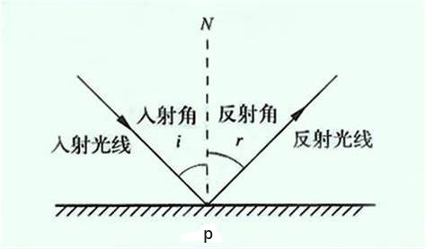

# Introduce

PBR, or more commonly known as physically based rendering, is a collection of render techniques that are more or less based on the same underlying theory that more closely matches that of the physical world. As physically based rendering aims to mimic light in a physically plausible way, it generally looks more realistic compared to our original lighting algorithms like Phong and Blinn-Phong. Not only does it look better, as it closely approximates actual physics, we (and especially the artists) can author surface materials based on physical parameters without having to resort to cheap hacks and tweaks to make the lighting look right. One of the bigger advantages of authoring materials based on physical parameters is that these materials will look correct regardless of lighting conditions; something that is not true in non-PBR pipelines.

PBR，常常称之为基于物理的渲染，是一系列渲染技术的统称，这些渲染技术都在不同程度上基于相同的更符合物理世界规律的基础理论。因为基于物理的渲染使用了一种更符合物理规律的方式来模拟光线，所以相比于原来的光照算法（像 Phong 或 Blinn-Phong）渲染效果看起来更加真实。除了看起来更好，因为非常接近实际物理规律，所以我们（尤其是美工）可以根据物理参数来制作表面材质，而无需借助粗劣的技巧和调整来使光照看起来正确。根据物理参数制作材质的一大优势是，无论光照条件如何，这些材质看起来都是正确的；而在非 PBR 管线中，光照改变后有些物体看起来就没那么真实了。

Physically based rendering is still nonetheless an approximation of reality (based on the principles of physics) which is why it's not called physical shading, but physically based shading. For a PBR lighting model to be considered physically based, it has to satisfy the following 3 conditions (don't worry, we'll get to them soon enough):

基于物理的渲染仍然只是对现实的一种近似（基于物理原理），这就是为什么它被称为基于物理的着色而非物理着色的原因。判断一种 PBR 光照模型是否是基于物理的，必须要满足以下三个条件（别担心，我们很快就会讲到）：

    1.Be based on the microfacet surface model.

    1.基于微平面表面模型。

    2.Be energy conserving.

    2.能量守恒。

    3.Use a physically based BRDF.

    3.应用基于物理的 BRDF。

In the next PBR chapters we'll be focusing on the PBR approach as originally explored by Disney and adopted for real-time display by Epic Games. Their approach, based on the metallic workflow, is decently documented, widely adopted on most popular engines, and looks visually amazing. By the end of these chapters we'll have something that looks like this:

在接下来的 PBR 章节中，我们将重点介绍最先由迪斯尼探索、后被 Epic Games 用于实时显示的 PBR 方法。他们的方法以金属工作流为基础，记录详实，并被大多数主流引擎广泛采用，视觉效果惊人。在这几章结束时，我们将得到这样的效果：

<p align="center">
  
</p>

Keep in mind, the topics in these chapters are rather advanced so it is advised to have a good understanding of OpenGL and shader lighting. Some of the more advanced knowledge you'll need for this series are: framebuffers, cubemaps, gamma correction, HDR, and normal mapping. We'll also delve into some advanced mathematics, but I'll do my best to explain the concepts as clear as possible.

请注意，这些章节探讨的内容相当高级，因此建议您充分了解 OpenGL 和着色器光照。阅读教程本系列章节所需的一些高级知识包括：帧缓冲、立方体贴图、伽玛校正、HDR 和法线贴图。我们还将深入学习一些高级数学知识，但我会尽我所能解释清楚这些概念。

# The microfacet model

All the PBR techniques are based on the theory of microfacets. The theory describes that any surface at a microscopic scale can be described by tiny little perfectly reflective mirrors called microfacets. Depending on the roughness of a surface, the alignment of these tiny little mirrors can differ quite a lot:

所有的PBR技术都基于微平面理论。该理论认为，达到微观尺度后任何表面都可以用被称为微平面的完美反射微小镜面来描绘。根据表面粗糙度的不同，这些微小镜面的排列会有很大差异：

<p align="center">
  
</p>

The rougher a surface is, the more chaotically aligned each microfacet will be along the surface. The effect of these tiny-like mirror alignments is, that when specifically talking about specular lighting/reflection, the incoming light rays are more likely to scatter along completely different directions on rougher surfaces, resulting in a more widespread specular reflection. In contrast, on a smooth surface the light rays are more likely to reflect in roughly the same direction, giving us smaller and sharper reflections:

一个平面越是粗糙，这个平面上的微表面的排列就越混乱。这些微小镜面混乱排列所产生的影响就是，当特指镜面光照/反射时，在粗糙的表面上入射光线被反射后更趋向于向着完全不同的方向散射，从而产生出分布范围更广的镜面反射。与此相反，在光滑的表面上，光线更有可能沿着大致相同的方向反射，从而产生更小、更锐利的反射：

<p align="center">
  
</p>

No surface is completely smooth on a microscopic level, but seeing as these microfacets are small enough that we can't make a distinction between them on a per-pixel basis, we statistically approximate the surface's microfacet roughness given a roughness parameter. Based on the roughness of a surface, we can calculate the ratio of microfacets roughly aligned to some vector $h$. This vector $h$ is the halfway vector that sits halfway between the light $l$ and view $v$ vector. We've discussed the halfway vector before in the advanced lighting chapter which is calculated as the sum of $l$ and $v$ divided by its length:

在微观尺度下任何表面都不是完全光滑的，而且由于这些微表面非常小，利用像素已经无法对它们再进行区分（微表面比像素小的多，不在一个观察尺度上），因此我们可以给定一个粗糙度参数，用统计学的方法来近似物体表面的微表面粗糙度。根据表面的粗糙度，我们可以计算出表面朝向与某个矢量 $h$ 大致对齐的微表面的占比。这个向量 $h$ 是位于光线 $l$ 和视线 $v$ 之间的半程向量。我们曾在高级光照一章中讨论过半程向量，它的计算方法是将 $l$ 和 $v$ 之和除以其长度：

$$
h = \frac{l+v}{||l+v||}
$$

The more the microfacets are aligned to the halfway vector, the sharper and stronger the specular reflection. Together with a roughness parameter that varies between 0 and 1, we can statistically approximate the alignment of the microfacets:

微表面的朝向与半程向量的方向越是一致（即微表面的法线与半程向量越是一致），镜面反射就越锐利、越强烈。结合在 0 和 1 之间变化的粗糙度参数，我们可以从统计学角度对微表面的排列情况进行近似：

<p align="center">
  
</p>

We can see that higher roughness values display a much larger specular reflection shape, in contrast with the smaller and sharper specular reflection shape of smooth surfaces.

我们可以看到，粗糙度值越高，镜面反射形状范围越大，而光滑表面的镜面反射形状则越小越锐利（边缘分明、细节突出）。

# Energy conservation

The microfacet approximation employs a form of energy conservation: outgoing light energy should never exceed the incoming light energy (excluding emissive surfaces). Looking at the above image we see the specular reflection area increase, but also its brightness decrease at increasing roughness levels. If the specular intensity were to be the same at each pixel (regardless of the size of the specular shape) the rougher surfaces would emit much more energy, violating the energy conservation principle. This is why we see specular reflections more intensely on smooth surfaces and more dimly on rough surfaces.

微表面近似采用了一种形式的能量守恒：出射光线的能量永远不应超过入射光线的能量（发光面除外）。观察上图，我们会发现随着粗糙度的增加，镜面反射面积在增大的同时而亮度在降低。如果每个像素的镜面反射强度相同（不管镜面反射形状的大小），那么粗糙的表面就会发射出更多的能量，从而违反能量守恒定律。这就是为什么我们看到光滑表面上的镜面反射更强烈，而粗糙表面上的镜面反射更暗淡的原因。

For energy conservation to hold, we need to make a clear distinction between diffuse and specular light. The moment a light ray hits a surface, it gets split in both a refraction part and a reflection part. The reflection part is light that directly gets reflected and doesn't enter the surface; this is what we know as specular lighting. The refraction part is the remaining light that enters the surface and gets absorbed; this is what we know as diffuse lighting.

为了保证能量守恒，我们需要明确区分漫反射光和镜面反射光。光线照射到表面的瞬间，会分成折射和反射两部分。反射部分是直接被反射而没有进入表面内部的光线；这就是我们所知道的镜面反射光线。折射部分是进入表面内部并被吸收的剩余光线；这就是我们所熟知的漫反射光。

There are some nuances here as refracted light doesn't immediately get absorbed by touching the surface. From physics, we know that light can be modeled as a beam of energy that keeps moving forward until it loses all of its energy; the way a light beam loses energy is by collision. Each material consists of tiny little particles that can collide with the light ray as illustrated in the following image. The particles absorb some, or all, of the light's energy at each collision which is converted into heat.

这里有一些细微差别，折射光不会在接触表面后立即被吸收。通过物理学我们可以得知，光线实际上可以被认为是一束没有耗尽就不停向前运动的能量，而光线是通过碰撞的方式来消耗能量的。如下图所示，每种材料都由微小的粒子组成，它们可以与光线发生碰撞。每次碰撞时，这些粒子都会吸收部分或全部光能，并转化为热量。

<p align="center">
  
</p>

Generally, not all energy is absorbed and the light will continue to scatter in a (mostly) random direction at which point it collides with other particles until its energy is depleted or it leaves the surface again. Light rays re-emerging out of the surface contribute to the surface's observed (diffuse) color. In physically based rendering however, we make the simplifying assumption that all refracted light gets absorbed and scattered at a very small area of impact, ignoring the effect of scattered light rays that would've exited the surface at a distance. Specific shader techniques that do take this into account are known as subsurface scattering techniques that significantly improve the visual quality on materials like skin, marble, or wax, but come at the price of performance.

一般来说，并不是所有的能量都会被吸收，光线会继续向（大部分）随机方向散射，并与其他粒子碰撞，直到能量耗尽或再次离开表面。从表面重新射出的光线会形成表面被观测到的（漫反射）颜色。不过，在基于物理的渲染中，我们做了一个简化假设，即所有折射光线都会在极小的影响范围内被吸收和散射，忽略经过内部散射而从表面其他位置射出的散射光线的影响。而有一些被称为次表面散射的着色器技术会将我们忽略的内容考虑进去，它可以显著改善皮肤、大理石或蜡等材质的视觉质量，但随之而来的代价是性能下降。

An additional subtlety when it comes to reflection and refraction are surfaces that are metallic. Metallic surfaces react different to light compared to non-metallic surfaces (also known as dielectrics). Metallic surfaces follow the same principles of reflection and refraction, but all refracted light gets directly absorbed without scattering. This means metallic surfaces only leave reflected or specular light; metallic surfaces show no diffuse colors. Because of this apparent distinction between metals and dielectrics, they're both treated differently in the PBR pipeline which we'll delve into further down the chapter.

金属表面的反射和折射还有一个细节需要注意。金属表面与非金属表面（也称为电介质）对光线的反应不同。金属表面遵循相同的反射和折射原理，但所有折射光都会被直接吸收而不会散射。这意味着金属表面只显示反射光或镜面反射光，不显示漫反射颜色。由于金属和电介质之间存在这种明显的区别，因此在 PBR 管线中对它们的处理方式也有所不同，我们将在本章中进一步深入探讨。

This distinction between reflected and refracted light brings us to another observation regarding energy preservation: they're mutually exclusive. Whatever light energy gets reflected will no longer be absorbed by the material itself. Thus, the energy left to enter the surface as refracted light is directly the resulting energy after we've taken reflection into account.

反射光和折射光之间的这种区别为我们带来了另一个关于能量守恒的经验结论：反射光与折射光它们二者之间是互斥的关系。被材质表面反射的光线能量将不会再被材质本身吸收。因此，进入表面后余下的折射光能量直接就是我们减去反射后剩下的能量。

We preserve this energy conserving relation by first calculating the specular fraction that amounts the percentage the incoming light's energy is reflected. The fraction of refracted light is then directly calculated from the specular fraction as:

按照能量守恒的关系，我们首先计算镜面反射部分（反射率），即入射光中被反射的的那部分在所有入射能量中占的百分比。然后根据镜面反射率直接计算出折射光的比例：

```glsl
float kS = calculateSpecularComponent(...); // reflection/specular fraction
float kD = 1.0 - kS;                        // refraction/diffuse  fraction
```

This way we know both the amount the incoming light reflects and the amount the incoming light refracts, while adhering to the energy conservation principle. Given this approach, it is impossible for both the refracted/diffuse and reflected/specular contribution to exceed 1.0, thus ensuring the sum of their energy never exceeds the incoming light energy. Something we did not take into account in the previous lighting chapters.

这样，我们既能知道入射光的反射量，也能知道入射光的折射量，同时还能遵守能量守恒定律。按照这种方法，折射/漫反射和反射/镜面反射所占的份额都不可能超过 1.0，从而确保它们的能量总和永远不会超过入射光的能量。这是在之前的光照章节中我们没有考虑的问题。

# The reflectance equation

This brings us to something called the render equation, an elaborate equation some very smart folks out there came up with that is currently the best model we have for simulating the visuals of light. Physically based rendering strongly follows a more specialized version of the render equation known as the reflectance equation. To properly understand PBR, it's important to first build a solid understanding of the reflectance equation:

在这里我们引入了一种被称为“渲染方程”的东西，它是某些聪明绝顶的人所构想出来的一个精妙的方程式，是目前我们模拟光线视觉效果最佳的模型。基于物理的渲染主要遵循渲染方程的一个更为特定的版本，即反射方程。要正确理解 PBR，首先必须对反射方程要有一个扎实的了解：

$$
L_o(p,\omega_o) = \int\limits_{\Omega} f_r(p,\omega_i,\omega_o) L_i(p,\omega_i) n \cdot \omega_i  d\omega_i
$$ 

The reflectance equation appears daunting at first, but as we'll dissect it you'll see it slowly starts to makes sense. To understand the equation, we have to delve into a bit of radiometry. Radiometry is the measurement of electromagnetic radiation, including visible light. There are several radiometric quantities we can use to measure light over surfaces and directions, but we will only discuss a single one that's relevant to the reflectance equation known as radiance, denoted here as $L$. Radiance is used to quantify the magnitude or strength of light coming from a single direction. It's a bit tricky to understand at first as radiance is a combination of multiple physical quantities so we'll focus on those first:

乍眼一看反射方程有点令人生畏，但随着我们对它的剖析，你会逐渐理解它的涵义。要理解这个公式，我们必须先了解一下辐射度量学。辐射度量学是对包括可见光在内的电磁辐射的测量手段。我们可以使用多种辐射度量量来测量表面和某些方向上的光线，但我们只讨论与反射方程相关的一个量，即辐射率，在这里表示为 $L$。辐射率用于量化来自单一方向的光的大小或强度。由于辐射率是多个物理量的组合，一开始理解起来有点困难，所以我们首先关注一下组成辐射率的那些物理量：

<strong>Radiant flux</strong>: radiant flux $\Phi$ is the transmitted energy of a light source measured in Watts. Light is a collective sum of energy over multiple different wavelengths, each wavelength associated with a particular (visible) color. The emitted energy of a light source can therefore be thought of as a function of all its different wavelengths. Wavelengths between 390nm to 700nm (nanometers) are considered part of the visible light spectrum i.e. wavelengths the human eye is able to perceive. Below you'll find an image of the different energies per wavelength of daylight:

<strong>辐射通量</strong>: 辐射通量 $\Phi$ 是光源所输出的能量，以瓦特为单位。光是多种不同波长的能量总和，每种波长和一种特定的（可见）颜色相关。因此，光源放射出的能量可以看作是光源包含的所有不同波长的一个函数。波长在 390 纳米到 700 纳米（纳米）之间的光被认为是可见光光谱的一部分，即人眼能够感知的波长。下面是日光各波长的不同能量图像：

<p align="center">
  
</p>

The radiant flux measures the total area of this function of different wavelengths. Directly taking this measure of wavelengths as input is slightly impractical so we often make the simplification of representing radiant flux, not as a function of varying wavelength strengths, but as a light color triplet encoded as RGB (or as we'd commonly call it: light color). This encoding does come at quite a loss of information, but this is generally negligible for visual aspects.

辐射通量测量的是这个不同波长函数的总面积。直接将这种波长测量值作为计算机图形的输入有些不切实际，因此我们通常会将辐射通量简化为 RGB（或我们通常所说的光色）编码的光色三元组，而不是不同波长强度的函数。这种编码方式确实会损失相当多的信息，但对于视觉效果上的影响通常是可以忽略不计的。

<strong>Solid angle</strong>: the solid angle, denoted as $\omega$, tells us the size or area of a shape projected onto a unit sphere. The area of the projected shape onto this unit sphere is known as the solid angle; you can visualize the solid angle as a direction with volume:

<strong>立体角</strong>: 立体角，用 $\omega$ 表示，它告诉我们投影到单位球上的一个截面的大小或面积。投影到这个单位球上的面积被称为立体角，你可以将立体角想象成一个带有体积的方向：

<p align="center">
  
</p>

Think of being an observer at the center of this unit sphere and looking in the direction of the shape; the size of the silhouette you make out of it is the solid angle.

可以把自己想象成一个站在单位球中心的观察者，向着投影的方向看去，你所看到的轮廓的大小就是实体角。

<strong>Radiant intensity</strong>: radiant intensity measures the amount of radiant flux per solid angle, or the strength of a light source over a projected area onto the unit sphere. For instance, given an omnidirectional light that radiates equally in all directions, the radiant intensity can give us its energy over a specific area (solid angle):

<strong>辐射强度</strong>: 辐射强度表示的是每单位立体角上的辐射通量，或者说是光源在单位球上的一个投影面积上的强度。例如，如果一个全向光在所有方向上的辐射量相同，那么辐射强度就能给出它在特定区域（立体角）上的能量大小：

<p align="center">
  
</p>

The equation to describe the radiant intensity is defined as follows:

计算辐射强度的公式如下所示：

$$
I = \frac{d\Phi}{d\omega}
$$

Where $I$ is the radiant flux $\Phi$ over the solid angle $\omega$. 

这里 $I$ 等于辐射通量 $\Phi$ 除以立体角 $\omega$。

With knowledge of radiant flux, radiant intensity, and the solid angle, we can finally describe the equation for <strong>radiance</strong>. Radiance is described as the total observed energy in an area $A$ over the solid angle $\omega$ of a light of radiant intensity $\Phi$:

有了辐射通量、辐射强度和立体角的知识后，我们终于可以描述 <strong>辐射率</strong> 方程了。辐射率被描述为辐射强度为 $\Phi$ 的光在立体角 $\omega$ 上的 $A$ 区域中观测到的总能量：

$$
L=\frac{d^2\Phi}{ dA d\omega \cos\theta}
$$

<p align="center">
  
</p>

Radiance is a radiometric measure of the amount of light in an area, scaled by the incident (or incoming) angle $\theta$ of the light to the surface's normal as $\cos \theta$: light is weaker the less it directly radiates onto the surface, and strongest when it is directly perpendicular to the surface. This is similar to our perception of diffuse lighting from the <a href="https://learnopengl.com/Lighting/Basic-lighting" target="_blank">basic lighting</a> chapter as $\cos \theta$ directly corresponds to the dot product between the light's direction vector and the surface normal:

辐射率是一个区域内光线数量的辐射度量，它受到入射（或来射）光线与表面法线间夹角 $\theta$ 的余弦值 $\cos \theta$ 的影响：当直接辐射到表面上的辐射率越少时，光线就越弱，而当光线直接垂直于表面时，辐射率最大。这与我们在 <a href="https://learnopengl.com/Lighting/Basic-lighting" target="_blank">基础光照</a> 一章中对漫反射光的感知类似，因为 $\cos \theta$ 直接对应于光线方向向量与表面法线之间的点积：

```glsl
float cosTheta = dot(lightDir, N);
```

The radiance equation is quite useful as it contains most physical quantities we're interested in. If we consider the solid angle $\omega$ and the area $A$ to be infinitely small, we can use radiance to measure the flux of a single ray of light hitting a single point in space. This relation allows us to calculate the radiance of a single light ray influencing a single (fragment) point; we effectively translate the solid angle $\omega$ into a direction vector $\omega$, and $A$ into a point $p$. This way, we can directly use radiance in our shaders to calculate a single light ray's per-fragment contribution.

辐射率方程非常有用，因为它包含了大多数我们感兴趣的物理量。如果认为立体角 $\omega$ 和面积 $A$ 是无穷小的，那么就可以把立体角 $\omega$ 转化为方向向量 $\omega$，把 $A$ 转化为点 $p$，我们就可以用辐射率来测量单束光线射向空间中单个点时的通量。通过这种关系，我们可以计算出作用于单个（片段）点上的单束光线的辐射率。这样，我们就可以在着色器中直接使用辐射率来计算单束光线对每个片段的贡献。

<div class="note-box">
  <p>
    <strong>Radient energy</strong>: 辐射能量，单位为焦耳。<br>
    <strong>Radient flux</strong>: 辐射通量，每单位时间的辐射能量，单位为瓦特。亦可称作“辐射功率（Radiant power）”。<br>
    <strong>Radient Intensity</strong>: 辐射强度，每单位立体角的辐射通量。表示的是一个光源向以它自身为球心的单位球面每单位立体角所投射的辐射通量。<br>
    <strong>Radiant exitance</strong>: 辐射出射度，表面出射的辐射通量，单位为瓦特每平方米。<br>
    <strong>Radiance</strong>: 辐射率，每单位立体角每单位投射表面的辐射通量，单位为瓦特每球面度每平方米。可分为 exiting radiance 和 incident radiance。<br>
    <strong>Irradiance</strong>: 辐照度，入射表面的辐射通量，单位为瓦特每平方米。Irradiance 是面积 $dA$ 上从整个半球方向上接收到的辐射通量。Radiance 只关注 $dA$ 从某一特定方向单位立体角上得到的辐射通量，Radiance 是 Irradiance 在某一方向上的微分，在半球域内对 Radiance 积分就可以得到 Irradiance。
  </p>
</div>

In fact, when it comes to radiance we generally care about all incoming light onto a point $p$, which is the sum of all radiance known as irradiance. With knowledge of both radiance and irradiance we can get back to the reflectance equation:

事实上，在谈到辐射率时，我们通常关心的是照射到点 $p$ 上的所有入射光，即称为辐照度的所有辐射率的总和。有了辐射度和辐照度的知识，我们就可以回到反射方程：

$$
L_o(p,\omega_o) = \int\limits_{\Omega} f_r(p,\omega_i,\omega_o) L_i(p,\omega_i) n \cdot \omega_i  d\omega_i
$$

We now know that $L$ in the render equation represents the radiance of some point $p$ and some incoming infinitely small solid angle $\omega_i$ which can be thought of as an incoming direction vector $\omega_i$. Remember that $\cos \theta$ scales the energy based on the light's incident angle to the surface, which we find in the reflectance equation as $n \cdot \omega_i$. The reflectance equation calculates the sum of reflected radiance $L_o(p, \omega_o)$ of a point $p$ in direction $\omega_o$ which is the outgoing direction to the viewer. Or to put it differently: $L_o$ measures the reflected sum of the lights' irradiance onto point $p$ as viewed from $\omega_o$.

现在我们知道，渲染方程中的 $L$ 代表了某个点 $p$ 和某个无穷小的入射立体角 $\omega_i$，可以将这个无穷小的入射立体角视为入射方向向量 $\omega_i$。请记住，我们利用光线到表面的入射角的余弦值 $\cos \theta$ 来计算能量，即就是反射方程中的 $n \cdot \omega_i$。用 $\omega_o$ 表示向着观察者的出射方向，反射方程计算的是一个点 $p$ 在 $\omega_o$ 方向上被反射的辐射率总和 $L_o(p,\omega_o)$。或者换一种说法：$L_o$ 测量的是从 $\omega_o$ 方向看向 $p$ 点时被反射的光线辐照度总和。

<p align="center">
  
</p>

The reflectance equation is based around irradiance, which is the sum of all incoming radiance we measure light of. Not just of a single incoming light direction, but of all incoming light directions within a hemisphere $\Omega$ centered around point $p$. A hemisphere can be described as half a sphere aligned around a surface's normal $n$:

反射方程以辐照度为基础，而辐照度是我们测量的所有入射光的辐射率的总和。所以我们需要计算的就不只是单一入射光方向，而是以点 $p$ 为中心的半球 $\Omega$ 内所有入射光方向的辐射率总和。一个半球可以描述为与表面法线 $n$ 对齐的法向半球：

<p align="center">
  
</p>

To calculate the total of values inside an area or (in the case of a hemisphere) a volume, we use a mathematical construct called an integral denoted in the reflectance equation as $\int$ over all incoming directions $d\omega_i$ within the hemisphere $\Omega$ . An integral measures the area of a function, which can either be calculated analytically or numerically. As there is no analytical solution to both the render and reflectance equation, we'll want to numerically solve the integral discretely. This translates to taking the result of small discrete steps of the reflectance equation over the hemisphere $\Omega$ and averaging their results over the step size. This is known as the Riemann sum that we can roughly visualize in code as follows:

要计算一个区域或（在半球的情况下）一个体积内数值的总和，我们可以利用一种称为积分的数学结构，在反射方程中表示为对半球 $\Omega$ 内所有入射方向 $d\omega_i$ 的 $\int$。积分测量的是一个函数的面积，可以通过分析或数值计算得出。由于渲染方程和反射方程都没有解析解，所以我们需要用数值求解离散积分。这个问题就转化为，在半球 $\Omega$ 上按小步长对反射方程进行离散求解，然后再根据步长大小将所得到的结果平均化。这就是所谓的黎曼和，我们可以在代码中将其过程大致可视化为如下：

```glsl
int steps = 100;
float sum = 0.0f;
vec3 P    = ...;
vec3 Wo   = ...;
vec3 N    = ...;
float dW  = 1.0f / steps;
for(int i = 0; i < steps; ++i) 
{
    vec3 Wi = getNextIncomingLightDir(i);
    sum += Fr(P, Wi, Wo) * L(P, Wi) * dot(N, Wi) * dW;
}
```

By scaling the steps by dW, the sum will equal the total area or volume of the integral function. The dW to scale each discrete step can be thought of as $d\omega_i$ in the reflectance equation. Mathematically $d\omega_i$ is the continuous symbol over which we calculate the integral, and while it does not directly relate to dW in code (as this is a discrete step of the Riemann sum), it helps to think of it this way. Keep in mind that taking discrete steps will always give us an approximation of the total area of the function. A careful reader will notice we can increase the accuracy of the Riemann Sum by increasing the number of steps.

式 `sum += Fr(P, Wi, Wo) * L(P, Wi) * dot(N, Wi) * dW` 中，通过 dW 来对 `Fr(P, Wi, Wo) * L(P, Wi) * dot(N, Wi)` 部分进行缩放，其总和将等于积分函数的总面积或总体积。用来对每个离散值进行缩放的 dW 可以看作反射方程中的 $d\omega_i$。虽然在数学上，用来计算积分的 $d\omega_i$ 是一个代表连续值的符号，它与代码中的 dW 没有直接关系（因为 dW 是黎曼和的离散步长），但这样想还是有帮助的。请注意，使用离散步长计算得到的是函数总面积的一个近似值。细心的读者会发现，我们可以通过增加步数来提高黎曼和的精度。

The reflectance equation sums up the radiance of all incoming light directions $\omega_i$ over the hemisphere $\Omega$ scaled by $f_r$ that hit point $p$ and returns the sum of reflected light $L_o$ in the viewer's direction. The incoming radiance can come from <a href="https://learnopengl.com/PBR/Lighting" target="_blank">light sources</a> as we're familiar with, or from an environment map measuring the radiance of every incoming direction as we'll discuss in the <a href="https://learnopengl.com/PBR/IBL/Diffuse-irradiance" target="_blank">IBL</a> chapters.

反射方程将半球 $\Omega$ 上所有到达入射点 $p$ 的入射光方向 $\omega_i$ 的辐射率经 $f_r$ 缩放后相加，并返回观察者方向的反射光总和 $L_o$。入射辐射率可以来自我们熟悉的<a href="https://learnopengl.com/PBR/Lighting" target="_blank">光源</a>，也可以来自测量了每个入射方向辐射率的环境图，我们将在 <a href="https://learnopengl.com/PBR/IBL/Diffuse-irradiance" target="_blank">IBL</a> 章节中讨论。

Now the only unknown left is the $f_r$ symbol known as the BRDF or bidirectional reflective distribution function that scales or weighs the incoming radiance based on the surface's material properties.

现在剩下的唯一未知数就是 $f_r$ 符号了，它被称为 BRDF 或双向反射分布函数，它的作用是根据表面的材料属性对入射辐射率进行缩放或加权。

# BRDF

The BRDF, or bidirectional reflective distribution function, is a function that takes as input the incoming (light) direction $\omega_i$, the outgoing (view) direction $\omega_o$, the surface normal $n$, and a surface parameter $a$ that represents the microsurface's roughness. The BRDF approximates how much each individual light ray $\omega_i$ contributes to the final reflected light of an opaque surface given its material properties. For instance, if the surface has a perfectly smooth surface (~like a mirror) the BRDF function would return 0.0 for all incoming light rays $\omega_i$ except the one ray that has the same (reflected) angle as the outgoing ray $\omega_o$ at which the function returns 1.0.

BRDF，即双向反射分布函数，以入射（光线）方向 $\omega_i$、出射（视线）方向 $\omega_o$、表面法线 $n$ 和表示微表面粗糙度的表面参数 $a$ 作为输入。BRDF 近似表示了一个给定材质属性的不透明表面上每束入射光线 $\omega_i$ 对最终反射出来光线 $\omega_o$ 的贡献度。例如，如果表面是完全光滑的（就像一面镜子），那么只有在入射光线的入射角与出射光线 $\omega_o$ 的反射角相同时，该函数才会返回 1.0，对于剩余所有其他入射角度光线 $\omega_i$，BRDF 函数都将返回 0.0。

A BRDF approximates the material's reflective and refractive properties based on the previously discussed microfacet theory. For a BRDF to be physically plausible it has to respect the law of energy conservation i.e. the sum of reflected light should never exceed the amount of incoming light. Technically, Blinn-Phong is considered a BRDF taking the same $\omega_i$ and $\omega_o$ as inputs. However, Blinn-Phong is not considered physically based as it doesn't adhere to the energy conservation principle. There are several physically based BRDFs out there to approximate the surface's reaction to light. However, almost all real-time PBR render pipelines use a BRDF known as the Cook-Torrance BRDF.

BRDF 是根据微表面理论对材质的反射和折射属性进行的近似分析。要使 BRDF 在物理上合理，就必须遵守能量守恒定律，即反射光能量的总和绝对不能超过入射光能量的总和。从技术上讲，同样采用 $\omega_i$ 和 $\omega_o$ 作为输入的 Blinn-Phong 也被认为是一种 BRDF。但是，Blinn-Phong 并不被认为是基于物理的，因为它不遵守能量守恒原则。有几种基于物理的 BRDF 可以近似地反映表面对光线的反应。不过，几乎所有的实时 PBR 渲染管线都使用 Cook-Torrance(库克-托伦斯) BRDF。

The Cook-Torrance BRDF contains both a diffuse and specular part:

Cook-Torrance BRDF 包含漫反射和镜面反射两个部分：

$$
f_r = k_d f_{lambert} +  k_s f_{cook-torrance}
$$

Here $k_d$ is the earlier mentioned ratio of incoming light energy that gets refracted with $k_s$ being the ratio that gets reflected. The left side of the BRDF states the diffuse part of the equation denoted here as $f_{lambert}$. This is known as Lambertian diffuse similar to what we used for diffuse shading, which is a constant factor denoted as:

这里的 $k_d$ 是入射光能量中被折射部分所占的比率，$k_s$ 是被反射部分所占的比率。BRDF 等式右侧第一项是漫反射部分，这里用 $f_{lambert}$ 表示。这就是所谓的朗伯（或称兰伯特）漫反射，类似于我们在漫反射着色中使用的方法，它是一个常数因子，被表示为：

$$
f_{lambert} = \frac{c}{\pi}
$$

With $c$ being the albedo or surface color (think of the diffuse surface texture). The divide by pi is there to normalize the diffuse light as the earlier denoted integral that contains the BRDF is scaled by $\pi$ (we'll get to that in the <a href="https://learnopengl.com/PBR/IBL/Diffuse-irradiance" target="_blank">IBL</a> chapters).

$c$ 是反照率或表面颜色（想想漫反射表面纹理）。除以 pi 是为了将漫反射光归一化，因为前面含有 BRDF 的积分方程是受 $\pi$ 影响的（我们会在 <a href="https://learnopengl.com/PBR/IBL/Diffuse-irradiance" target="_blank">IBL</a> 的教程中探讨这个问题的）。

<div class="note-box">
  <p>
    You may wonder how this Lambertian diffuse relates to the diffuse lighting we've been using before: the surface color multiplied by the dot product between the surface's normal and the light direction. The dot product is still there, but moved out of the BRDF as we find $n \cdot \omega_i$ at the end of the $L_o$ integral.<br>
    <br>
    你也许会感到好奇，这个朗伯漫反射与我们之前使用的漫反射光照有什么关系：之前计算漫反射参数，是利用表面颜色乘以表面法线与光线方向之间的点积。现在点积 $n \cdot \omega_i$ 仍然还在，只是从 BRDF 中移出去了，移到了 $L_o$ 积分的末尾。
  </p>
</div>

There exist different equations for the diffuse part of the BRDF which tend to look more realistic, but are also more computationally expensive. As concluded by Epic Games however, the Lambertian diffuse is sufficient enough for most real-time rendering purposes.

目前有许多不同类型的方程可以用来实现 BRDF 的漫反射部分，它们往往会使光照看起来更逼真，但随之计算成本也更高。不过，正如 Epic Games 总结的那样，朗伯漫反射已经能满足大多数实时渲染用途了。

The specular part of the BRDF is a bit more advanced and is described as:

BRDF 的镜面反射部分更为高级，其形式如下所示

$$
f_{CookTorrance} = \frac{DFG}{4(\omega_o \cdot n)(\omega_i \cdot n)}
$$

The Cook-Torrance specular BRDF is composed three functions and a normalization factor in the denominator. Each of the D, F and G symbols represent a type of function that approximates a specific part of the surface's reflective properties. These are defined as the normal <strong>D</strong>istribution function, the <strong>F</strong>resnel equation and the <strong>G</strong>eometry function:

Cook-Torrance BRDF 的镜面反射部分由分子上的三个函数和分母上的标准化因子组成。字母 D，F 与 G 分别代表一种类型的函数，各个类型函数分别用来近似计算出表面反射特性中的一个特定部分。三个函数分别是法线分布函数(<strong>D</strong>)，菲涅尔方程(<strong>F</strong>)，和几何函数(<strong>G</strong>)：

* <strong>Normal distribution function</strong>: approximates the amount the surface's microfacets are aligned to the halfway vector, influenced by the roughness of the surface; this is the primary function approximating the microfacets.

* <strong>法线分布函数</strong>：估算物体表面上朝向与半程向量方向一致的微表面的数量，这个数量受到表面粗糙度的影响。法线分布函数是用来近似微表面的主要函数。

* <strong>Geometry function</strong>: describes the self-shadowing property of the microfacets. When a surface is relatively rough, the surface's microfacets can overshadow other microfacets reducing the light the surface reflects.

* <strong>几何函数</strong>：描述了微表面自阴影属性。当一个表面相对比较粗糙的时候，表面上的一些微表面有可能挡住其他的微表面，从而减少了表面所反射的光线数量。

* <strong>Fresnel equation</strong>: The Fresnel equation describes the ratio of surface reflection at different surface angles.

* <strong>菲涅尔方程</strong>：菲涅尔方程描述了不同表面角度下的表面反射率。

Each of these functions are an approximation of their physics equivalents and you'll find more than one version of each that aims to approximate the underlying physics in different ways; some more realistic, others more efficient. It is perfectly fine to pick whatever approximated version of these functions you want to use. Brian Karis from Epic Games did a great deal of research on the multiple types of approximations here. We're going to pick the same functions used by Epic Game's Unreal Engine 4 which are the Trowbridge-Reitz GGX for D, the Fresnel-Schlick approximation for F, and the Smith's Schlick-GGX for G.

这些函数中的每一个都是其物理世界中真实情况的等价近似，而且你会发现每一个函数都有不止一种实现形式，但是不管是什么样的形式，最终目标都是去近似底层实际物理情况；有些实现方式可以使镜面反射更逼真，有些则更高效。你完全可以自由选择你想使用的这些函数的任何近似版本。在这方面，来自 Epic Games 的布莱恩-卡里斯（Brian Karis）对多种类型的近似实现方法进行了大量研究。我们将选择与 Epic Game 的虚幻引擎 4 相同的函数，即 D 使用 "Trowbridge-Reitz GGX"、F 使用 “Fresnel-Schlick 近似” 和 G 使用 "Smith's Schlick-GGX"。

## Normal distribution function

The normal distribution function $D$ statistically approximates the relative surface area of microfacets exactly aligned to the (halfway) vector $h$. There are a multitude of NDFs that statistically approximate the general alignment of the microfacets given some roughness parameter and the one we'll be using is known as the Trowbridge-Reitz GGX:

法线分布函数 $D$ 从统计学角度近似地表示了朝向与（半程）向量 $h$ 一致的微表面的相对表面积。举例来说，如果我们的物体表面上有35%的微表面它的朝向与 $h$ 方向完全一致，那么 NDF 的值就是 0.35。有许多类型 NDF 可以在给定一些粗糙度参数的情况下统计出微表面一般排列的近似值，我们接下来要使用的 NDF 是 Trowbridge-Reitz GGX：

$$
NDF_{GGX TR}(n, h, \alpha) = \frac{\alpha^2}{\pi((n \cdot h)^2 (\alpha^2 - 1) + 1)^2}
$$

Here $h$ is the halfway vector to measure against the surface's microfacets, with $a$ being a measure of the surface's roughness. If we take $h$ as the halfway vector between the surface normal and light direction over varying roughness parameters we get the following visual result:

这里的 $h$ 是用来与物体表面的微表面做比较用的半程向量，$a$ 是表面粗糙度的测量值。如果将 $h$ 作为表面法线和光照方向之间的半程向量，在改变粗糙度参数的情况下，我们会得到以下直观的镜面反射结果：

<p align="center">
  
</p>

When the roughness is low (thus the surface is smooth), a highly concentrated number of microfacets are aligned to halfway vectors over a small radius. Due to this high concentration, the NDF displays a very bright spot. On a rough surface however, where the microfacets are aligned in much more random directions, you'll find a much larger number of halfway vectors $h$ somewhat aligned to the microfacets (but less concentrated), giving us the more grayish results.

当粗糙度较低时（因此表面是光滑的），与半程向量朝向一致的微表面会高度集中在一个较小半径的区域内。这样的话朝向观察者进行反射的微表面集中在一起，镜面反射会呈现为非常明亮的光斑。然而，在粗糙的表面上，微表面的排列方向更加随机，你将会发现与 $h$ 向量朝向一致的微平面分布在一个大得多的半径范围内，朝向观察者进行反射的微表面不那么集中了，比较分散，这让镜面反射效果显得更加灰暗。

In GLSL the Trowbridge-Reitz GGX normal distribution function translates to the following code:

在 GLSL 中，Trowbridge-Reitz GGX 法线分布函数可转换为以下代码：

```glsl
float DistributionGGX(vec3 N, vec3 H, float a)
{
    float a2     = a*a;
    float NdotH  = max(dot(N, H), 0.0);
    float NdotH2 = NdotH*NdotH;
	
    float nom    = a2;
    float denom  = (NdotH2 * (a2 - 1.0) + 1.0);
    denom        = PI * denom * denom;
	
    return nom / denom;
}
```

# Geometry function

The geometry function statistically approximates the relative surface area where its micro surface-details overshadow each other, causing light rays to be occluded.

几何函数从统计学角度近似地计算了相互遮挡的微表面的相对表面积，这种相互遮蔽会导致光线被遮挡，无法反射到观察者的位置。

<p align="center">
  
</p>

Similar to the NDF, the Geometry function takes a material's roughness parameter as input with rougher surfaces having a higher probability of overshadowing microfacets. The geometry function we will use is a combination of the GGX and Schlick-Beckmann approximation known as Schlick-GGX:

与 NDF 类似，几何函数将材料的粗糙度参数作为输入，较粗糙的表面更有可能在微表面间产生遮盖。我们将使用的几何函数是 GGX 和 “Schlick-Beckmann 近似” 的结合体，称为 Schlick-GGX：

$$
G_{SchlickGGX}(n, v, k) 
       		 = 
   		\frac{n \cdot v}
    	{(n \cdot v)(1 - k) + k }
$$

Here $k$ is a remapping of $\alpha$ based on whether we're using the geometry function for either direct lighting or IBL lighting:

这里的 $k$ 是 $\alpha$ 的重映射，具体采用何种映射方式，取决于我们在使用几何函数时，是针对直接光照还是 IBL 光照：

$$
k_{direct} = \frac{(\alpha + 1)^2}{8}
$$

$$
k_{IBL} = \frac{\alpha^2}{2}
$$

Note that the value of $\alpha$ may differ based on how your engine translates roughness to $\alpha$. In the following chapters we'll extensively discuss how and where this remapping becomes relevant. 

请注意，$\alpha$ 的值可能因你的渲染引擎采用何种方式将粗糙度转换为 $\alpha$ 而异。在接下来的章节中，我们将会展开来讨论如何以及在何处进行重映射。

To effectively approximate the geometry we need to take account of both the view direction (geometry obstruction) and the light direction vector (geometry shadowing). We can take both into account using Smith's method:

为了有效地近似物体表面几何特性，我们需要同时考虑视线方向（几何体阻挡）和光线方向向量（几何体阴影）。我们可以使用史密斯方法将两者都考虑在内：

$$
G(n, v, l, k) = G_{sub}(n, v, k) G_{sub}(n, l, k) 
$$

Using Smith's method with Schlick-GGX as $G_{sub}$ gives the following visual appearance over varying roughness R:

使用史密斯方法，以 Schlick-GGX 作为 $G_{sub}$，在粗糙度 R 不同的情况下，可以得到如下视觉效果：

<p align="center">
  
</p>

The geometry function is a multiplier between [0.0, 1.0] with 1.0 (or white) measuring no microfacet shadowing, and 0.0 (or black) complete microfacet shadowing.

几何函数是介于 [0.0, 1.0] 之间的乘数，1.0（或白色）表示没有微表面阴影，0.0（或黑色）表示微表面彻底被遮挡。

In GLSL the geometry function translates to the following code:

使用 GLSL 编写的几何函数代码如下：

```glsl
float GeometrySchlickGGX(float NdotV, float k)
{
    float nom   = NdotV;
    float denom = NdotV * (1.0 - k) + k;
	
    return nom / denom;
}
  
float GeometrySmith(vec3 N, vec3 V, vec3 L, float k)
{
    float NdotV = max(dot(N, V), 0.0);
    float NdotL = max(dot(N, L), 0.0);
    float ggx1 = GeometrySchlickGGX(NdotV, k);
    float ggx2 = GeometrySchlickGGX(NdotL, k);
	
    return ggx1 * ggx2;
}
```

## Fresnel equation

The Fresnel equation (pronounced as Freh-nel) describes the ratio of light that gets reflected over the light that gets refracted, which varies over the angle we're looking at a surface. The moment light hits a surface, based on the surface-to-view angle, the Fresnel equation tells us the percentage of light that gets reflected. From this ratio of reflection and the energy conservation principle we can directly obtain the refracted portion of light.

菲涅尔方程（发音为 Freh-nel）描述的是反射光与折射光的比例，这个比例会随着我们观察表面的角度而变化。在光线照射到表面的瞬间，根据表面与视线的角度，菲涅尔方程可以告诉我们反射光的比例。根据这个反射比例和能量守恒原理，我们可以直接得出光的折射部分。

Every surface or material has a level of base reflectivity when looking straight at its surface, but when looking at the surface from an angle all reflections become more apparent compared to the surface's base reflectivity. You can check this for yourself by looking at your (presumably) wooden/metallic desk which has a certain level of base reflectivity from a perpendicular view angle, but by looking at your desk from an almost 90 degree angle you'll see the reflections become much more apparent. All surfaces theoretically fully reflect light if seen from perfect 90-degree angles. This phenomenon is known as Fresnel and is described by the Fresnel equation.

光线垂直照射到表面或材质上时，发生一部分反射，此时对应的反射率称为基础反射率。如果以一定的角度往平面上看的时候所有反光都会变得明显起来。你可以通过观察你的木制/金属书桌（大概）来验证这一点，从垂直视角看，此时只有最基础的反射，但从近乎 90 度的角度（指视线和法线的夹角，即接近平行桌面的视角）看你的书桌，你会发现反射变得更加明显。如果从完全 90 度的角度观察，理论上所有表面都能完全反射光线。这种现象被称为菲涅尔现象，用菲涅尔方程来描述。