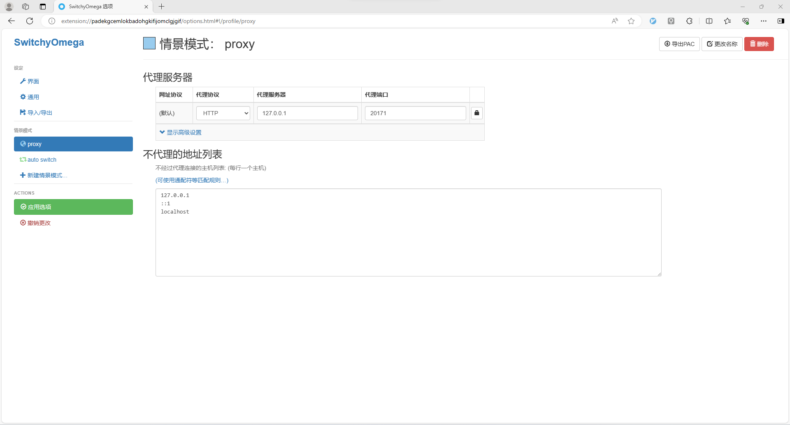

# 0. 系统环境

操作系统版本信息：Unbuntu 22.04.4

# 1. 安装 v2rayA

## 1.1 安装 v2ray-core 内核

### 1.1.1 下载 v2ray-core

从 github 下载 [v2ray core](https://github.com/v2ray/v2ray-core/releases)，ubuntu x64 系统选择如下安装包：

```
v2ray-linux-64.zip
```

### 1.1.2 安装 v2ray-core

将其解压到 /usr/local/v2ray-core ：

```
sudo unzip v2ray-linux-64.zip -d /usr/local/v2ray-core
```

复制可执行文件到 /usr/local/bin ：

```
sudo cp /usr/local/v2ray-core/v2ray /usr/local/bin/
```

复制 dat 文件到 /usr/local/share/v2ray/ ：

```
sudo mkdir -p /usr/local/share/v2ray
sudo cp /usr/local/v2ray-core/*.dat /usr/local/share/v2ray/
```

## 1.2 安装 v2rayA

### 1.2.1 下载 v2ray-core

从 github 下载 [v2rayA](https://github.com/v2rayA/v2rayA/releases)，ubuntu x64 系统选择如下类似安装包：

```
installer_debian_x64_2.2.5.1.deb
```

### 1.2.2 安装 v2rayA

执行如下命令安装 v2rayA ：

```
sudo apt install installer_debian_x64_2.2.5.1.deb
```

### 1.2.3 配置 v2rayA 启动环境（测试配置后也无法找到可执行文件和配置文件，有效性待讨论验证，目前这一步是可省略的）

修改 /etc/default/v2raya 配置文件让 v2raya 使用 v2ray-core，去掉 V2RAYA_V2RAY_BIN 和 V2RAYA_V2RAY_CONFDIR 的注释并修改其值为：

```
V2RAYA_V2RAY_BIN=/usr/local/v2ray-core/v2ray

V2RAYA_V2RAY_CONFDIR=/usr/local/v2ray-core
```

# 2. 运行 v2rayA

## 2.1 启动 v2rayA

在终端执行如下命令启动 v2raya ：

```
sudo v2raya
```

然后打开 v2raya 的管理页面，创建账号，导入节点。导入节点成功后，节点将显示在 SERVER 或新的标签中。切换到该标签页，选择一个或多个节点连接，在左上角点击就绪按钮启动服务。默认情况下 v2rayA 会通过核心开放 20170(socks5), 20171(http), 20172(带分流规则的 http) 端口。可以在 设置=>地址与端口 页面修改端口。

# 3. 浏览器上网配置

## 3.1 安装 SwitchyOmega

在 [浏览器应用商店](https://chromewebstore.google.com/?hl=zh) 下载安装插件 [Proxy SwitchyOmega](https://chromewebstore.google.com/detail/padekgcemlokbadohgkifijomclgjgif?hl=zh)。

## 3.2 配置 SwitchyOmega

由于这里使用默认开放的端口，在 SwitchyOmega 插件配置页面，情景模式：proxy => 代理服务器 栏下，分别配置代理协议、代理服务器和代理端口，如下图：



当代理协议选择 HTTP 时， 代理端口选择 20171；当代理协议选择 SOCKS5 时， 代理端口选择 20170。配置完代理服务器后在 ACTIONS 栏下点击 应用选项 按钮以生效配置。当浏览器需要使用代理时，选择配置好的情景模式：


[back](./../)
