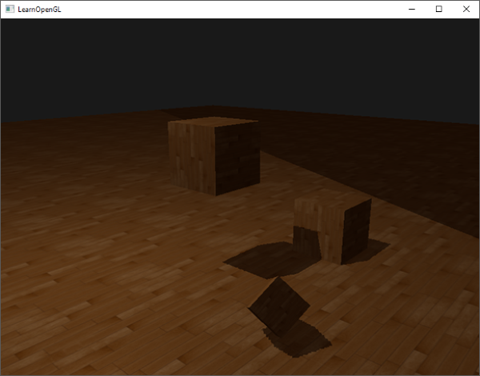
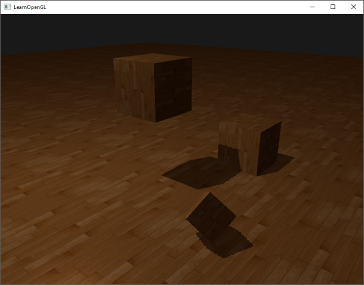

# Improving shadow maps

## Over sampling

Another visual discrepancy which you may like or dislike is that regions outside the light's visible frustum are considered to be in shadow while they're (usually) not. This happens because projected coordinates outside the light's frustum are higher than 1.0 and will thus sample the depth texture outside its default range of [0,1]. Based on the texture's wrapping method, we will get incorrect depth results not based on the real depth values from the light source.

<p align="center">
  
</p>

You can see in the image that there is some sort of imaginary region of light, and a large part outside this area is in shadow; this area represents the size of the depth map projected onto the floor. The reason this happens is that we earlier set the depth map's wrapping options to GL_REPEAT.

What we'd rather have is that all coordinates outside the depth map's range have a depth of 1.0 which as a result means these coordinates will never be in shadow (as no object will have a depth larger than 1.0). We can do this by configuring a texture border color and set the depth map's texture wrap options to GL_CLAMP_TO_BORDER:

```c
glTexParameteri(GL_TEXTURE_2D, GL_TEXTURE_WRAP_S, GL_CLAMP_TO_BORDER);
glTexParameteri(GL_TEXTURE_2D, GL_TEXTURE_WRAP_T, GL_CLAMP_TO_BORDER);
float borderColor[] = { 1.0f, 1.0f, 1.0f, 1.0f };
glTexParameterfv(GL_TEXTURE_2D, GL_TEXTURE_BORDER_COLOR, borderColor);
```

Now whenever we sample outside the depth map's [0,1] coordinate range, the texture function will always return a depth of 1.0, producing a shadow value of 0.0. The result now looks more plausible:

<p align="center">
  
</p>

<div class="note-box">
  <p>
    在计算片段是否是阴影点时，若该片段是以光源为视角的视图体范围之外的场景片段，那么其在光源视图体内裁剪坐标是超出 [-w, w] 范围之外的（正射视图 w = 1.0），从光源视角的场景深度图采样深度值的时候，裁剪坐标转换到纹理坐标会超出 [0.0, 1.0] 范围之外，超出纹理范围之外 OpenGL 默认的行为是重复这个纹理图像进行采样，光源视图体区域外就会有一些地方显示阴影不正确的情况。其实在以光源为视角的视图体范围之外的片段应该处理为非阴影点，所以我们更希望所有超出深度图范围的坐标的采样返回值是 1.0，因此可以设置纹理边框颜色 z 分量为 1.0，并设置纹理环绕方式为超出坐标为用户指定的边缘颜色 GL_CLAMP_TO_BORDER。这一步限制的是采样深度图后返回的深度值。
  </p>
</div>

There seems to still be one part showing a dark region. Those are the coordinates outside the far plane of the light's orthographic frustum. You can see that this dark region always occurs at the far end of the light source's frustum by looking at the shadow directions.

A light-space projected fragment coordinate is further than the light's far plane when its z coordinate is larger than 1.0. In that case the GL_CLAMP_TO_BORDER wrapping method doesn't work anymore as we compare the coordinate's z component with the depth map values; this always returns true for z larger than 1.0.

The fix for this is also relatively easy as we simply force the shadow value to 0.0 whenever the projected vector's z coordinate is larger than 1.0:

```c
float ShadowCalculation(vec4 fragPosLightSpace)
{
    [...]
    if(projCoords.z > 1.0)
        shadow = 0.0;
    
    return shadow;
}  
```

Checking the far plane and clamping the depth map to a manually specified border color solves the over-sampling of the depth map. This finally gives us the result we are looking for:

<p align="center">
  
</p>

The result of all this does mean that we only have shadows where the projected fragment coordinates sit inside the depth map range so anything outside the light frustum will have no visible shadows.

<div class="note-box">
  <p>
    在计算片段是否是阴影点时，若该片段是以光源为视角的视图体范围之外的场景片段，那么其在光源视图体内裁剪坐标是超出 [-w, w] 范围之外的（正射视图 w = 1.0），归一化深度值也是大于 1.0 的。其实在以光源为视角的视图体范围之外的片段应该处理为非阴影点，所以我们在光源视图体内片段的裁剪坐标深度值大于 w.0 时直接认定为非阴影点。这一步限制的是片段在光源视图体内深度值。
  </p>
</div>

[back](./../)