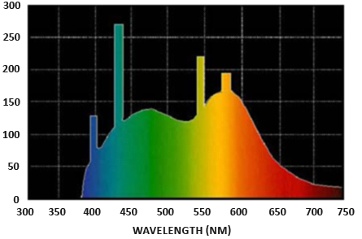

<head>
    <script src="https://cdn.mathjax.org/mathjax/latest/MathJax.js?config=TeX-AMS-MML_HTMLorMML" type="text/javascript"></script>
    <script type="text/x-mathjax-config">
        MathJax.Hub.Config({
            tex2jax: {
                skipTags: ['script', 'noscript', 'style', 'textarea', 'pre'],
                inlineMath: [['$','$']]
            }
        });
    </script>
</head>

<div class="sidebar">
  <ul>
    <li><a class="sidebar-link" href="#introduce">{{ Introduce }}</a><li>
  </ul>
</div>

# Introduce

PBR, or more commonly known as physically based rendering, is a collection of render techniques that are more or less based on the same underlying theory that more closely matches that of the physical world. As physically based rendering aims to mimic light in a physically plausible way, it generally looks more realistic compared to our original lighting algorithms like Phong and Blinn-Phong. Not only does it look better, as it closely approximates actual physics, we (and especially the artists) can author surface materials based on physical parameters without having to resort to cheap hacks and tweaks to make the lighting look right. One of the bigger advantages of authoring materials based on physical parameters is that these materials will look correct regardless of lighting conditions; something that is not true in non-PBR pipelines.

PBR，常常称之为基于物理的渲染，是一系列渲染技术的统称，这些渲染技术都在不同程度上基于相同的更符合物理世界规律的基础理论。因为基于物理的渲染使用了一种更符合物理规律的方式来模拟光线，所以相比于原来的光照算法（像 Phong 或 Blinn-Phong）渲染效果看起来更加真实。除了看起来更好，因为非常接近实际物理规律，所以我们（尤其是美工）可以根据物理参数来制作表面材质，而无需借助粗劣的技巧和调整来使光照看起来正确。根据物理参数制作材质的一大优势是，无论光照条件如何，这些材质看起来都是正确的；而在非 PBR 管线中，光照改变后有些物体看起来就没那么真实了。

Physically based rendering is still nonetheless an approximation of reality (based on the principles of physics) which is why it's not called physical shading, but physically based shading. For a PBR lighting model to be considered physically based, it has to satisfy the following 3 conditions (don't worry, we'll get to them soon enough):

基于物理的渲染仍然只是对现实的一种近似（基于物理原理），这就是为什么它被称为基于物理的着色而非物理着色的原因。判断一种 PBR 光照模型是否是基于物理的，必须要满足以下三个条件（别担心，我们很快就会讲到）：

    1.Be based on the microfacet surface model.

    1.基于微平面表面模型。

    2.Be energy conserving.

    2.能量守恒。

    3.Use a physically based BRDF.

    3.应用基于物理的 BRDF。

In the next PBR chapters we'll be focusing on the PBR approach as originally explored by Disney and adopted for real-time display by Epic Games. Their approach, based on the metallic workflow, is decently documented, widely adopted on most popular engines, and looks visually amazing. By the end of these chapters we'll have something that looks like this:

在接下来的 PBR 章节中，我们将重点介绍最先由迪斯尼探索、后被 Epic Games 用于实时显示的 PBR 方法。他们的方法以金属工作流为基础，记录详实，并被大多数主流引擎广泛采用，视觉效果惊人。在这几章结束时，我们将得到这样的效果：

<p align="center">
  
</p>

Keep in mind, the topics in these chapters are rather advanced so it is advised to have a good understanding of OpenGL and shader lighting. Some of the more advanced knowledge you'll need for this series are: framebuffers, cubemaps, gamma correction, HDR, and normal mapping. We'll also delve into some advanced mathematics, but I'll do my best to explain the concepts as clear as possible.

请注意，这些章节探讨的内容相当高级，因此建议您充分了解 OpenGL 和着色器光照。阅读教程本系列章节所需的一些高级知识包括：帧缓冲、立方体贴图、伽玛校正、HDR 和法线贴图。我们还将深入学习一些高级数学知识，但我会尽我所能解释清楚这些概念。

# The microfacet model

All the PBR techniques are based on the theory of microfacets. The theory describes that any surface at a microscopic scale can be described by tiny little perfectly reflective mirrors called microfacets. Depending on the roughness of a surface, the alignment of these tiny little mirrors can differ quite a lot:

所有的PBR技术都基于微平面理论。该理论认为，达到微观尺度后任何表面都可以用被称为微平面的完美反射微小镜面来描绘。根据表面粗糙度的不同，这些微小镜面的排列会有很大差异：

<p align="center">
  
</p>

The rougher a surface is, the more chaotically aligned each microfacet will be along the surface. The effect of these tiny-like mirror alignments is, that when specifically talking about specular lighting/reflection, the incoming light rays are more likely to scatter along completely different directions on rougher surfaces, resulting in a more widespread specular reflection. In contrast, on a smooth surface the light rays are more likely to reflect in roughly the same direction, giving us smaller and sharper reflections:

一个平面越是粗糙，这个平面上的微表面的排列就越混乱。这些微小镜面混乱排列所产生的影响就是，当特指镜面光照/反射时，在粗糙的表面上入射光线被反射后更趋向于向着完全不同的方向散射，从而产生出分布范围更广的镜面反射。与此相反，在光滑的表面上，光线更有可能沿着大致相同的方向反射，从而产生更小、更锐利的反射：

<p align="center">
  
</p>

No surface is completely smooth on a microscopic level, but seeing as these microfacets are small enough that we can't make a distinction between them on a per-pixel basis, we statistically approximate the surface's microfacet roughness given a roughness parameter. Based on the roughness of a surface, we can calculate the ratio of microfacets roughly aligned to some vector $h$. This vector $h$ is the halfway vector that sits halfway between the light $l$ and view $v$ vector. We've discussed the halfway vector before in the advanced lighting chapter which is calculated as the sum of $l$ and $v$ divided by its length:

在微观尺度下任何表面都不是完全光滑的，而且由于这些微表面非常小，利用像素已经无法对它们再进行区分（微表面比像素小的多，不在一个观察尺度上），因此我们可以给定一个粗糙度参数，用统计学的方法来近似物体表面的微表面粗糙度。根据表面的粗糙度，我们可以计算出表面朝向与某个矢量 $h$ 大致对齐的微表面的占比。这个向量 $h$ 是位于光线 $l$ 和视线 $v$ 之间的半程向量。我们曾在高级光照一章中讨论过半程向量，它的计算方法是将 $l$ 和 $v$ 之和除以其长度：

$$
h = \frac{l+v}{||l+v||}
$$

The more the microfacets are aligned to the halfway vector, the sharper and stronger the specular reflection. Together with a roughness parameter that varies between 0 and 1, we can statistically approximate the alignment of the microfacets:

微表面的朝向与半程向量的方向越是一致，镜面反射就越锐利、越强烈。结合在 0 和 1 之间变化的粗糙度参数，我们可以从统计学角度对微表面的排列情况进行近似：

<p align="center">
  
</p>

We can see that higher roughness values display a much larger specular reflection shape, in contrast with the smaller and sharper specular reflection shape of smooth surfaces.

我们可以看到，粗糙度值越高，镜面反射形状范围越大，而光滑表面的镜面反射形状则越小越锐利（边缘分明、细节突出）。

# Energy conservation

The microfacet approximation employs a form of energy conservation: outgoing light energy should never exceed the incoming light energy (excluding emissive surfaces). Looking at the above image we see the specular reflection area increase, but also its brightness decrease at increasing roughness levels. If the specular intensity were to be the same at each pixel (regardless of the size of the specular shape) the rougher surfaces would emit much more energy, violating the energy conservation principle. This is why we see specular reflections more intensely on smooth surfaces and more dimly on rough surfaces.

微表面近似采用了一种形式的能量守恒：出射光线的能量永远不应超过入射光线的能量（发光面除外）。观察上图，我们会发现随着粗糙度的增加，镜面反射面积在增大的同时而亮度在降低。如果每个像素的镜面反射强度相同（不管镜面反射形状的大小），那么粗糙的表面就会发射出更多的能量，从而违反能量守恒定律。这就是为什么我们看到光滑表面上的镜面反射更强烈，而粗糙表面上的镜面反射更暗淡的原因。

For energy conservation to hold, we need to make a clear distinction between diffuse and specular light. The moment a light ray hits a surface, it gets split in both a refraction part and a reflection part. The reflection part is light that directly gets reflected and doesn't enter the surface; this is what we know as specular lighting. The refraction part is the remaining light that enters the surface and gets absorbed; this is what we know as diffuse lighting.

为了保证能量守恒，我们需要明确区分漫反射光和镜面反射光。光线照射到表面的瞬间，会分成折射和反射两部分。反射部分是直接被反射而没有进入表面内部的光线；这就是我们所知道的镜面反射光线。折射部分是进入表面内部并被吸收的剩余光线；这就是我们所熟知的漫反射光。

There are some nuances here as refracted light doesn't immediately get absorbed by touching the surface. From physics, we know that light can be modeled as a beam of energy that keeps moving forward until it loses all of its energy; the way a light beam loses energy is by collision. Each material consists of tiny little particles that can collide with the light ray as illustrated in the following image. The particles absorb some, or all, of the light's energy at each collision which is converted into heat.

这里有一些细微差别，折射光不会在接触表面后立即被吸收。通过物理学我们可以得知，光线实际上可以被认为是一束没有耗尽就不停向前运动的能量，而光线是通过碰撞的方式来消耗能量的。如下图所示，每种材料都由微小的粒子组成，它们可以与光线发生碰撞。每次碰撞时，这些粒子都会吸收部分或全部光能，并转化为热量。

<p align="center">
  
</p>

Generally, not all energy is absorbed and the light will continue to scatter in a (mostly) random direction at which point it collides with other particles until its energy is depleted or it leaves the surface again. Light rays re-emerging out of the surface contribute to the surface's observed (diffuse) color. In physically based rendering however, we make the simplifying assumption that all refracted light gets absorbed and scattered at a very small area of impact, ignoring the effect of scattered light rays that would've exited the surface at a distance. Specific shader techniques that do take this into account are known as subsurface scattering techniques that significantly improve the visual quality on materials like skin, marble, or wax, but come at the price of performance.

一般来说，并不是所有的能量都会被吸收，光线会继续向（大部分）随机方向散射，并与其他粒子碰撞，直到能量耗尽或再次离开表面。从表面重新射出的光线会形成表面被观测到的（漫反射）颜色。不过，在基于物理的渲染中，我们做了一个简化假设，即所有折射光线都会在极小的影响范围内被吸收和散射，忽略经过内部散射而从表面其他位置射出的散射光线的影响。而有一些被称为次表面散射的着色器技术会将我们忽略的内容考虑进去，它可以显著改善皮肤、大理石或蜡等材质的视觉质量，但随之而来的代价是性能下降。

An additional subtlety when it comes to reflection and refraction are surfaces that are metallic. Metallic surfaces react different to light compared to non-metallic surfaces (also known as dielectrics). Metallic surfaces follow the same principles of reflection and refraction, but all refracted light gets directly absorbed without scattering. This means metallic surfaces only leave reflected or specular light; metallic surfaces show no diffuse colors. Because of this apparent distinction between metals and dielectrics, they're both treated differently in the PBR pipeline which we'll delve into further down the chapter.

金属表面的反射和折射还有一个细节需要注意。金属表面与非金属表面（也称为电介质）对光线的反应不同。金属表面遵循相同的反射和折射原理，但所有折射光都会被直接吸收而不会散射。这意味着金属表面只显示反射光或镜面反射光，不显示漫反射颜色。由于金属和电介质之间存在这种明显的区别，因此在 PBR 管线中对它们的处理方式也有所不同，我们将在本章中进一步深入探讨。

This distinction between reflected and refracted light brings us to another observation regarding energy preservation: they're mutually exclusive. Whatever light energy gets reflected will no longer be absorbed by the material itself. Thus, the energy left to enter the surface as refracted light is directly the resulting energy after we've taken reflection into account.

反射光和折射光之间的这种区别为我们带来了另一个关于能量守恒的经验结论：反射光与折射光它们二者之间是互斥的关系。被材质表面反射的光线能量将不会再被材质本身吸收。因此，进入表面后余下的折射光能量直接就是我们减去反射后剩下的能量。

We preserve this energy conserving relation by first calculating the specular fraction that amounts the percentage the incoming light's energy is reflected. The fraction of refracted light is then directly calculated from the specular fraction as:

按照能量守恒的关系，我们首先计算镜面反射部分（反射率），即入射光中被反射的的那部分在所有入射能量中占的百分比。然后根据镜面反射率直接计算出折射光的比例：

```glsl
float kS = calculateSpecularComponent(...); // reflection/specular fraction
float kD = 1.0 - kS;                        // refraction/diffuse  fraction
```

This way we know both the amount the incoming light reflects and the amount the incoming light refracts, while adhering to the energy conservation principle. Given this approach, it is impossible for both the refracted/diffuse and reflected/specular contribution to exceed 1.0, thus ensuring the sum of their energy never exceeds the incoming light energy. Something we did not take into account in the previous lighting chapters.

这样，我们既能知道入射光的反射量，也能知道入射光的折射量，同时还能遵守能量守恒定律。按照这种方法，折射/漫反射和反射/镜面反射所占的份额都不可能超过 1.0，从而确保它们的能量总和永远不会超过入射光的能量。这是在之前的光照章节中我们没有考虑的问题。

# The reflectance equation

This brings us to something called the render equation, an elaborate equation some very smart folks out there came up with that is currently the best model we have for simulating the visuals of light. Physically based rendering strongly follows a more specialized version of the render equation known as the reflectance equation. To properly understand PBR, it's important to first build a solid understanding of the reflectance equation:

在这里我们引入了一种被称为“渲染方程”的东西，它是某些聪明绝顶的人所构想出来的一个精妙的方程式，是目前我们模拟光线视觉效果的最佳模型。基于物理的渲染主要遵循渲染方程的一个更为特定的版本，即反射方程。要正确理解 PBR，首先必须对反射方程要有一个扎实的了解：

$$
L_o(p,\omega_o) = \int\limits_{\Omega} f_r(p,\omega_i,\omega_o) L_i(p,\omega_i) n \cdot \omega_i  d\omega_i
$$ 

The reflectance equation appears daunting at first, but as we'll dissect it you'll see it slowly starts to makes sense. To understand the equation, we have to delve into a bit of radiometry. Radiometry is the measurement of electromagnetic radiation, including visible light. There are several radiometric quantities we can use to measure light over surfaces and directions, but we will only discuss a single one that's relevant to the reflectance equation known as radiance, denoted here as $L$. Radiance is used to quantify the magnitude or strength of light coming from a single direction. It's a bit tricky to understand at first as radiance is a combination of multiple physical quantities so we'll focus on those first:

乍眼一看反射方程有点令人生畏，但随着我们对它的剖析，你会逐渐理解它的涵义。要理解这个公式，我们必须先了解一下辐射度量学。辐射度量学是对包括可见光在内的电磁辐射的测量手段。我们可以使用多种辐射度量量来测量表面和某些方向上的光线，但我们只讨论与反射方程相关的一个量，即辐射率，在这里表示为 $L$。辐射率用于量化来自单一方向的光的大小或强度。由于辐射率是多个物理量的组合，一开始理解起来有点困难，所以我们首先关注一下组成辐射率的那些物理量：

<strong>Radiant flux</strong>: radiant flux $\Phi$ is the transmitted energy of a light source measured in Watts. Light is a collective sum of energy over multiple different wavelengths, each wavelength associated with a particular (visible) color. The emitted energy of a light source can therefore be thought of as a function of all its different wavelengths. Wavelengths between 390nm to 700nm (nanometers) are considered part of the visible light spectrum i.e. wavelengths the human eye is able to perceive. Below you'll find an image of the different energies per wavelength of daylight:

<strong>辐射通量</strong>: 辐射通量 $\Phi$ 是光源所输出的能量，以瓦特为单位。光是多种不同波长的能量总和，每种波长和一种特定的（可见）颜色相关。因此，光源放射出的能量可以看作是光源包含的所有不同波长的一个函数。波长在 390 纳米到 700 纳米（纳米）之间的光被认为是可见光光谱的一部分，即人眼能够感知的波长。下面是日光各波长的不同能量图像：

<p align="center">
  
</p>

The radiant flux measures the total area of this function of different wavelengths. Directly taking this measure of wavelengths as input is slightly impractical so we often make the simplification of representing radiant flux, not as a function of varying wavelength strengths, but as a light color triplet encoded as RGB (or as we'd commonly call it: light color). This encoding does come at quite a loss of information, but this is generally negligible for visual aspects.

辐射通量测量的是这个不同波长函数的总面积。直接将这种波长测量值作为计算机图形的输入有些不切实际，因此我们通常会将辐射通量简化为 RGB（或我们通常所说的光色）编码的光色三元组，而不是不同波长强度的函数。这种编码方式确实会损失相当多的信息，但对于视觉效果上的影响通常是可以忽略不计的。

<strong>Solid angle</strong>: the solid angle, denoted as $\omega$, tells us the size or area of a shape projected onto a unit sphere. The area of the projected shape onto this unit sphere is known as the solid angle; you can visualize the solid angle as a direction with volume:

<strong>立体角</strong>: 立体角，用 $\omega$ 表示，它告诉我们投影到单位球上的一个截面的大小或面积。投影到这个单位球上的面积被称为立体角，你可以将立体角想象成一个带有体积的方向：

<p align="center">
  
</p>

Think of being an observer at the center of this unit sphere and looking in the direction of the shape; the size of the silhouette you make out of it is the solid angle.

可以把自己想象成一个站在单位球中心的观察者，向着投影的方向看去，你所看到的轮廓的大小就是实体角。

<strong>Radiant intensity</strong>: radiant intensity measures the amount of radiant flux per solid angle, or the strength of a light source over a projected area onto the unit sphere. For instance, given an omnidirectional light that radiates equally in all directions, the radiant intensity can give us its energy over a specific area (solid angle):

<strong>辐射强度</strong>: 辐射强度表示的是每单位立体角上的辐射通量，或者说是光源在单位球上的一个投影面积上的强度。例如，如果一个全向光在所有方向上的辐射量相同，那么辐射强度就能给出它在特定区域（立体角）上的能量大小：

<p align="center">
  
</p>

The equation to describe the radiant intensity is defined as follows:

计算辐射强度的公式如下所示：

$$
I = \frac{d\Phi}{d\omega}
$$

Where $I$ is the radiant flux $\Phi$ over the solid angle $\omega$. 

这里 $I$ 等于辐射通量 $\Phi$ 除以立体角 $\omega$。

With knowledge of radiant flux, radiant intensity, and the solid angle, we can finally describe the equation for <strong>radiance</strong>. Radiance is described as the total observed energy in an area $A$ over the solid angle $\omega$ of a light of radiant intensity $\Phi$:

有了辐射通量、辐射强度和立体角的知识后，我们终于可以描述 <strong>辐射率</strong> 方程了。辐射率被描述为辐射强度为 $\Phi$ 的光在立体角 $\omega$ 上的 $A$ 区域中观测到的总能量：

$$
L=\frac{d^2\Phi}{ dA d\omega \cos\theta}
$$

<p align="center">
  
</p>

Radiance is a radiometric measure of the amount of light in an area, scaled by the incident (or incoming) angle $\theta$ of the light to the surface's normal as $\cos \theta$: light is weaker the less it directly radiates onto the surface, and strongest when it is directly perpendicular to the surface. This is similar to our perception of diffuse lighting from the <a href="https://learnopengl.com/Lighting/Basic-lighting" target="_blank">basic lighting</a> chapter as $\cos \theta$ directly corresponds to the dot product between the light's direction vector and the surface normal:

辐射率是一个区域内光线数量的辐射度量，它受到入射（或来射）光线与表面法线间夹角 $\theta$ 的余弦值 $\cos \theta$ 的影响：当直接辐射到表面上的辐射率越少时，光线就越弱，而当光线直接垂直于表面时，辐射率最大。这与我们在 <a href="https://learnopengl.com/Lighting/Basic-lighting" target="_blank">基础光照</a> 一章中对漫反射光的感知类似，因为 $\cos \theta$ 直接对应于光线方向向量与表面法线之间的点积：

```glsl
float cosTheta = dot(lightDir, N);
```

The radiance equation is quite useful as it contains most physical quantities we're interested in. If we consider the solid angle $\omega$ and the area $A$ to be infinitely small, we can use radiance to measure the flux of a single ray of light hitting a single point in space. This relation allows us to calculate the radiance of a single light ray influencing a single (fragment) point; we effectively translate the solid angle $\omega$ into a direction vector $\omega$, and $A$ into a point $p$. This way, we can directly use radiance in our shaders to calculate a single light ray's per-fragment contribution.

辐射率方程非常有用，因为它包含了大多数我们感兴趣的物理量。如果认为立体角 $\omega$ 和面积 $A$ 是无穷小的，那么就可以把立体角 $\omega$ 转化为方向向量 $\omega$，把 $A$ 转化为点 $p$，我们就可以用辐射率来测量单束光线射向空间中单个点时的通量。通过这种关系，我们可以计算出作用于单个（片段）点上的单束光线的辐射率。这样，我们就可以在着色器中直接使用辐射率来计算单束光线对每个片段的贡献。