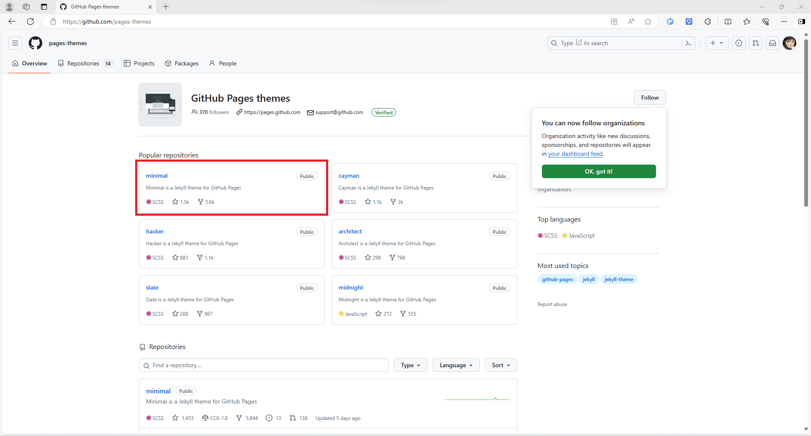
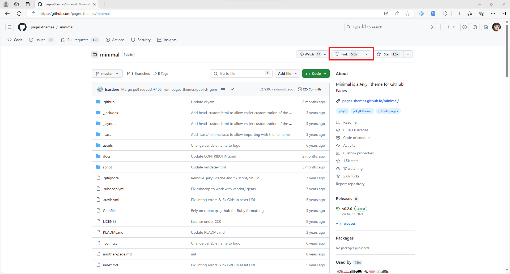
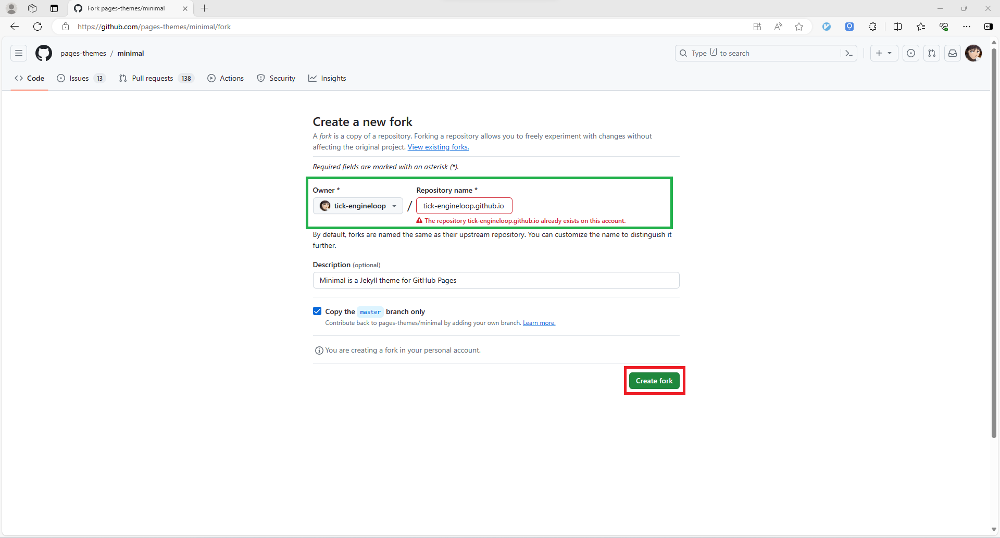

1. 进入 Github Pages themes 页面，选择一个喜欢的主题，比如我选择的是 minimal：

2. 进入选择的 minimal 主题仓库页面，点击 fork：

3. 创建一个 fork 自 minimal 的主题仓库，仓库名称前缀必须是与 Owner 相同，后缀必须是 github.io，填写仓库名称后点击 Create fork 按钮完成 fork 任务：

这样就搭建完成了一个最基础的Github Pages页面，稍等一会就可以访问自己创建的 Github Page 页面了，后续工作就是逐步修改和丰富自己的页面。