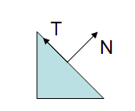
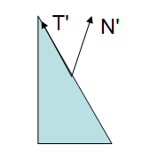

&emsp;&emsp;多边形模型中的顶点除了空间位置信息，还包括一些关于该顶点与周围表面关系的附加信息。在所有附加信息中，切向量和法向量是最常见的顶点附加信息，当进行模型变换时，不仅要变换顶点的位置，还要变换这些法向量和切向量。

&emsp;&emsp;切向量可通过计算一个顶点位置和另外一个顶点位置之间的差获得，因此可以用变换后的两个顶点位置之间的差表示变换后的切向量。由于切向量和法向量不受平移变换的影响，所以在顶点的切向量变换中可使用去掉齐次项的 3x3 模型变换矩阵 $\mathbf{M}$。

&emsp;&emsp;与切向量的变换相比，法向量的变换要复杂一些。下图是一个带有法向量 $\mathbf{T}$ 和切向量 $\mathbf{N}$ 的三角形：

当用一个包含非均匀缩放的非正交矩阵 $\mathbf{M}$ 变换法向量时，变换后的法向量常常指向一个与变换表面不垂直的方向，如下图所示：

&emsp;&emsp;因为切向量和法向量总是垂直的，则同一个顶点的切向量 $\mathbf{T}$ 和法向量 $\mathbf{N}$ 一定满足方程 $\mathbf{T} \cdot \mathbf{N}=0$（垂直向量点积为零），变换后的切向量 $\mathbf{T}^{\prime}$ 和法向量 $\mathbf{N}^{\prime}$ 也满足该方程，给定一个变换矩阵 $\mathbf{M}$，$\mathbf{T}^{\prime}=\mathbf{MT}$。假设法向量 $\mathbf{N}$ 的变换矩阵为 $\mathbf{G}$，则下式成立：

$$
\mathbf{N}^{\prime} \cdot \mathbf{T}^{\prime}=(\mathbf{GN}) \cdot (\mathbf{MT})=0
$$

$\mathbf{T}$、$\mathbf{N}$、$\mathbf{T}^{\prime}$、$\mathbf{N}^{\prime}$ 为列向量，$\mathbf{G}$ 和 $\mathbf{M}$ 分别为 $\mathbf{N}$ 和 $\mathbf{T}$ 的变换矩阵，$\mathbf{GN}$ 和 $\mathbf{MT}$ 是矩阵与向量的乘积并且结果仍为列向量，由此可见 $(\mathbf{GN}) \cdot (\mathbf{MT})$ 是两个列向量的点积，又因为向量的点积可以写成矩阵乘的形式，所以经代数变换可得：

$$
(\mathbf{GN}) \cdot (\mathbf{MT})=(\mathbf{GN})^{\mathrm{T}}(\mathbf{MT})=\mathbf{N}^{\mathrm{T}}\mathbf{G}^{\mathrm{T}}\mathbf{MT}
$$

&emsp;&emsp;由于 $\mathbf{N}^{\mathrm{T}}\mathbf{T}=\mathbf{N} \cdot \mathbf{T}=0$，所以如果 $\mathbf{G}^{\mathrm{T}}\mathbf{M}=\mathbf{I}$，则 $\mathbf{N}^{\mathrm{T}}\mathbf{G}^{\mathrm{T}}\mathbf{MT}=0$，可知 $\mathbf{G}=(\mathbf{M}^{-1})^{\mathrm{T}}$。因此，使法向量正确旋转的变换矩阵应为顶点变换矩阵的逆矩阵的转置矩阵。

&emsp;&emsp;如果矩阵 $\mathbf{M}$ 为正交矩阵，那么 $\mathbf{M}^{-1}=\mathbf{M}^{\mathrm{T}}$，则 $(\mathbf{M}^{-1})^{\mathrm{T}}=\mathbf{M}$，这时为了计算法向量的变换矩阵的求逆矩阵和转置矩阵的操作可以避免。

